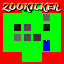
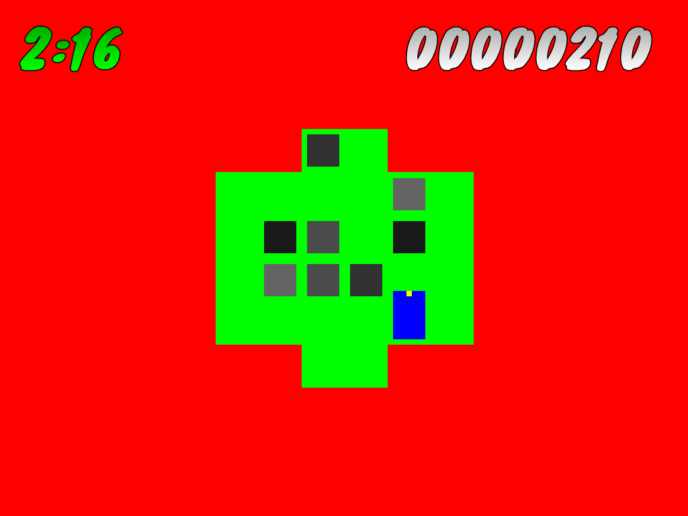

# zookicker



[My #1GAM February backup plan](http://www.cipht.net/2015/03/01/zookicker.html).
Released under the GPL; music is CC-BY-SA; fonts are not mine and are
under either SIL or the Ubuntu font license.

## Building for install

```
opam pin add tsdl git://github.com/tokenrove/tsdl.git
opam pin add tsdl-image git://github.com/tokenrove/tsdl-image.git
opam pin add tsdl-mixer git://github.com/tokenrove/tsdl-mixer.git
oasis setup
ocaml setup.ml -all
ocaml setup.ml -install
```

## Developing

```
oasis setup -setup-update dynamic
ocaml setup.ml -configure --enable-tests
ocaml setup.ml -all
```

## Screenshot


